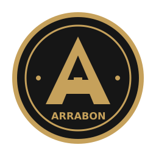

<p align="center">
  
</p>

# Arrabon

Mobile-first сервис для продажи консультаций с некастодиальным USDC-escrow в
сети Base.

Эксперт создаёт одноразовую ссылку на конкретный слот, клиент оплачивает
консультацию в USDC, а смарт-контракт удерживает средства до подтверждения
оказанной услуги. Ссылка на встречу раскрывается только участникам сделки после
оплаты.

MVP полностью реализован и протестирован. Коммерческий запуск не состоялся
после прекращения маркетингового направления команды; публичный сервис сейчас
не работает. Репозиторий сохранён как технический и продуктовый кейс.

## Коротко о проекте

| | |
|---|---|
| **Роль** | Самостоятельная продуктовая и техническая разработка |
| **Период** | 26 марта — 21 мая 2026 года, 57 календарных дней |
| **Результат** | Рабочий end-to-end MVP и контракт в Base Mainnet |
| **Объём работы** | 225 коммитов одного автора за период активной разработки, 13 страниц и 28 API-маршрутов |
| **Проверка качества** | 71 тестовый файл и 68 описанных QA-сценариев |

Я отвечал за продуктовую логику, пользовательские сценарии, UX, frontend,
backend, базу данных, смарт-контракт, тестирование и подготовку к развёртыванию.
AI использовался как рабочий инструмент разработки; результат проверялся
тестами, аудитами и прохождением полных пользовательских сценариев.

## Пользовательский сценарий

```text
Эксперт создаёт одноразовую ссылку
              ↓
Клиент подключает кошелёк и оплачивает консультацию в USDC
              ↓
Средства блокируются в ConsultEscrow на Base
              ↓
Участникам открывается зашифрованная ссылка на встречу
              ↓
Эксперт отмечает консультацию завершённой
              ↓
Клиент подтверждает выплату или открывает спор
              ↓
При отсутствии ответа доступен auto-release после 48 часов
```

## Что реализовано

- создание, просмотр и отмена одноразовых ссылок на консультацию;
- атомарное создание и финансирование escrow-сделки в USDC;
- подключение кошелька и SIWE-аутентификация с server-side сессиями;
- шифрование meeting URL через AES-256-GCM и раскрытие только участникам;
- полный lifecycle сделки: funding, completion, release, dispute, refund и
  auto-release;
- EIP-712 авторизация funding-операций и защита от повторного использования;
- личные кабинеты эксперта и клиента;
- offchain-переписка участников внутри открытого спора;
- admin-интерфейс для споров, compliance-проверок и denylist;
- AML/compliance screening через Chainalysis oracle, USDC blacklist и локальный
  denylist;
- фоновая синхронизация подтверждённых onchain-событий с PostgreSQL;
- юридические страницы, refund policy и уведомления о compliance-ограничениях;
- mobile-first интерфейс для встроенного браузера Base App.

## Архитектура

```text
Mobile browser / Base App
          │
          ▼
Next.js application
  ├─ React frontend + wagmi/viem
  ├─ Route Handlers API
  └─ background event-sync worker
          │
          ├─ Supabase PostgreSQL
          ├─ compliance providers
          └─ Base L2 / ConsultEscrow.sol
```

Frontend и backend работают в одном Next.js-приложении. Критичные переходы
состояния и хранение средств находятся в смарт-контракте, а приватные данные,
сессии и продуктовые метаданные — в PostgreSQL. Worker индексирует только
подтверждённые события и обновляет offchain read model идемпотентно.

## Контракт

`ConsultEscrow.sol` развёрнут в Base Mainnet:

- **адрес:**
  [`0x2EB0e35AbF9035f7A3B1807B857dc33518D1C5aD`](https://basescan.org/address/0x2EB0e35AbF9035f7A3B1807B857dc33518D1C5aD)
- **транзакция развёртывания:**
  [`0x4d0ed8…68fa`](https://basescan.org/tx/0x4d0ed801e47f7dcde43139da2e9a11eb4c53b63ef27e32db1a9998a6d4ed68fa)
- **сеть:** Base Mainnet, chain ID 8453
- **блок:** 46201204

Контракт реализует custody USDC, state machine сделки, single-use enforcement,
EIP-712 funding authorization, dispute flow, legal hold и выплату или возврат
средств.

## Стек

**Application:** TypeScript, Next.js App Router, React, TanStack Query

**Wallet и blockchain:** wagmi, viem, SIWE, Solidity, Hardhat, OpenZeppelin,
Base L2, USDC

**Data:** Supabase PostgreSQL, server-side sessions, background event sync

**Security и compliance:** AES-256-GCM, EIP-712, Chainalysis oracle, USDC
blacklist, local denylist, append-only audit log

## Проверка качества

Проект включает:

- unit-тесты frontend, backend и бизнес-логики;
- API smoke tests;
- Hardhat-тесты смарт-контракта;
- 68 документированных QA-сценариев и 20 критичных инвариантов;
- threat model и отдельный анализ AML/compliance;
- последовательные внутренние audit-проходы перед финальной версией MVP.

Проверяются authentication и access control, временные границы сделки,
escrow-state machine, funding/release flows, шифрование meeting URL,
идемпотентность indexer, compliance-гейты и административное разрешение споров.

## Структура репозитория

```text
app/           страницы и Next.js Route Handlers
components/    UI-компоненты
contexts/      wallet/session state
hooks/         продуктовые пользовательские flows
lib/           auth, database, contracts, compliance и domain logic
contracts/     ConsultEscrow.sol и вспомогательные контракты
supabase/      схема и миграции PostgreSQL
server/        background event-sync worker
tests/         unit, API и contract tests
docs/          спецификация, архитектура, threat model и QA
design-assets/ фирменные SVG-ассеты
```

## Документация

| Документ | Содержание |
|---|---|
| [Product specification](docs/product-spec.md) | Scope MVP и продуктовые правила |
| [Architecture](docs/architecture.md) | Границы компонентов и onchain/offchain split |
| [User flows](docs/flows.md) | Основные и ошибочные пользовательские сценарии |
| [State machine](docs/state-machine.md) | Состояния ссылок, сделок и compliance |
| [API contract](docs/api-contract.md) | Контракты Route Handlers |
| [Auth model](docs/auth-model.md) | SIWE и server-side сессии |
| [Threat model](docs/threat-model.md) | Активы, угрозы и mitigations |
| [QA scenarios](docs/qa-scenarios.md) | Проверяемые сценарии и инварианты |
| [Deployments](docs/deployments.md) | Адреса контрактов и история развёртываний |

Полный индекс находится в [docs/INDEX.md](docs/INDEX.md).

## Статус

MVP завершён. Контракт был развёрнут в Base Mainnet, но полноценный коммерческий
запуск продукта не состоялся после прекращения маркетингового направления
команды. Приложение больше не поддерживается и не доступно как публичный сервис.

## Лицензия

Исходный код опубликован для ознакомления. Открытая лицензия не предоставляется;
все права защищены.
